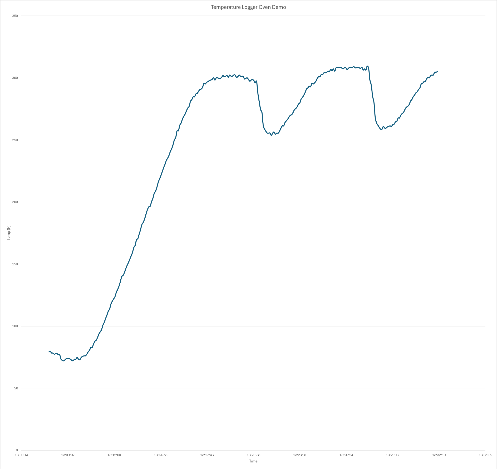
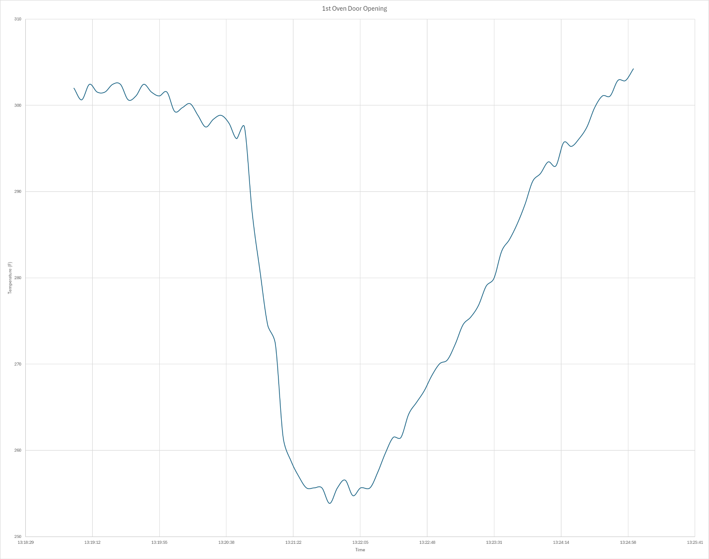
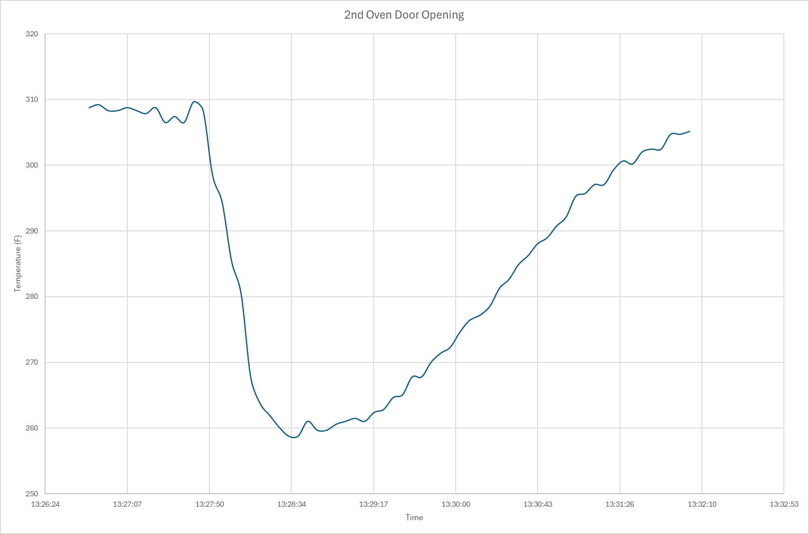
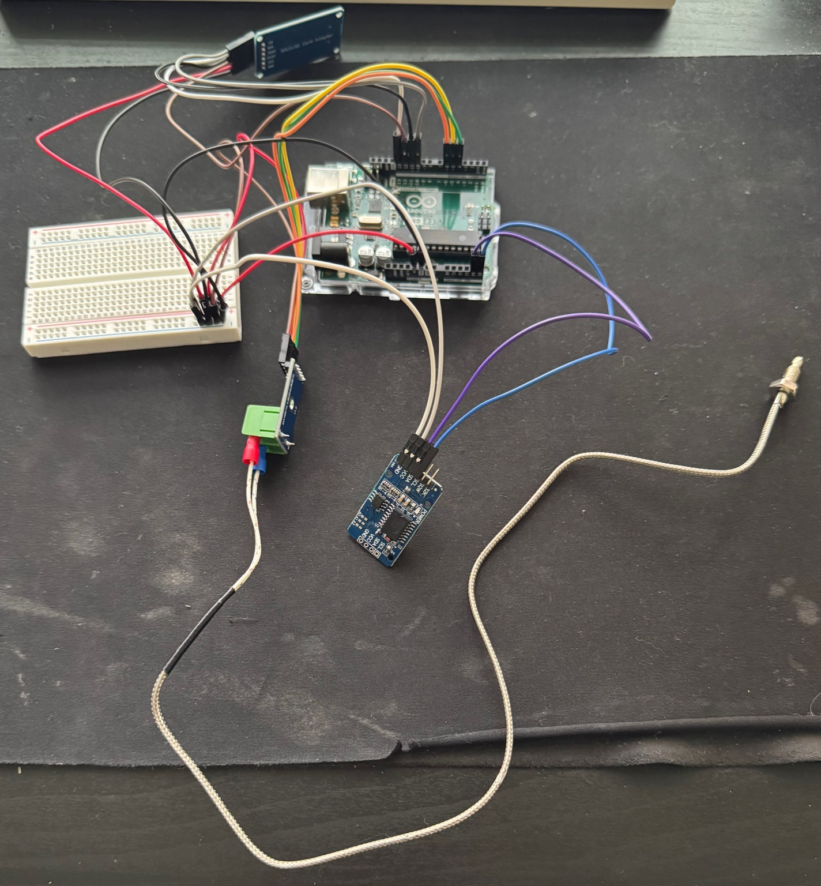

# Arduino Smoker Temperature Logger with SD + RTC (BBQ Data Logger)

This project logs air temperature inside a high-heat environment like a smoker or oven using an Arduino Uno, MAX6675 thermocouple, DS3231 RTC, and SD card module. It’s designed to be portable and accurate for long cooking sessions.

---

## 🔧 Components Used

- Arduino Uno  
- MAX6675 Thermocouple Module  
- K-Type Thermocouple Probe  
- DS3231 RTC Module  
- MicroSD Card Module  
- Breadboard + Jumper Wires  
- USB Power Bank

---

##  Features

- Logs air temperature every 5 seconds (adjustable)
- Timestamps each reading using a DS3231 RTC
- Saves data in `.csv` format to a MicroSD card
- Portable — can run off battery power for field use
- Suitable for long BBQ cooks, ovens, and thermal tests

---

## 📊 Demo: Oven Test

The system was tested in an oven to simulate smoker conditions. The graphs below show temperature readings over time and how quickly the chamber recovers after door openings.






###  Heat Recovery Example
- Temperature dropped from ~300°F to ~255°F when oven door opened
- Took ~4 minutes to recover to steady-state temperature

---

## 📁 Repository Contents

- `arduino_code/` — Arduino sketch files  
- `data_logs/` — Example `.csv` log files  
- `demo/` — Setup photos and temperature graphs  
- `docs/` — Circuit diagram and portfolio PDFs (WIP)  
- `README.md` — This file

---

##  Project Setup Photo



---

## 🔌 Wiring Summary

| Module         | Arduino Pin |
|----------------|-------------|
| MAX6675 DO     | D4          |
| MAX6675 CS     | D5          |
| MAX6675 CLK    | D6          |
| SD Card CS     | D10         |
| SD Card MOSI   | D11         |
| SD Card MISO   | D12         |
| SD Card SCK    | D13         |
| RTC SDA        | A4          |
| RTC SCL        | A5          |

---

##  How to Use

1. Connect the components (see wiring summary)
2. Upload sketch using Arduino IDE
3. Insert a MicroSD card
4. Power Arduino via USB or battery pack
5. Place thermocouple probe in smoker/oven
6. Data will begin logging every 5 seconds

---

##  Sample Output

```csv
13:25:14, 305.25°F  
13:25:19, 305.10°F  
13:25:24, 304.95°F  
